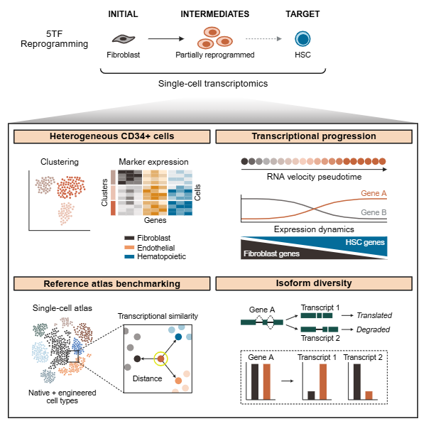

# Hematokytos

Hematokytos ("blood cell") collects pipelines and utilities for gathering, integrating, and analyzing single-cell transcriptomics data from direct reprogramming experiments alongside native hematopoietic cell types. Workflows cover preprocessing, quality control, RNA velocity, and alternative splicing analysis with a focus on hematopoietic stem and progenitor cells.


*This repository contains the code and pipelines used in Transcriptional landscape of direct reprogramming toward the hematopoietic lineage (iScience 2026).*




## Citation
If you use this repository, please cite:

Cwycyshyn, J., Stansbury, C., Golts, S., Lee, H., Pickard, J., Meixner, W., Rajapakse, I., and Muir, L. A. Transcriptional landscape of direct reprogramming toward the hematopoietic lineage. *iScience*. 2026.

```bibtex
@article{cwycyshyn2026hematokytos,
  title={Transcriptional landscape of direct reprogramming toward the hematopoietic lineage},
  author={Cwycyshyn, J. and Stansbury, C. and Golts, S. and Lee, H. and Pickard, J. and Meixner, W. and Rajapakse, I. and Muir, L. A.},
  journal={iScience},
  year={2026}
}
```


## Repository Structure

- `pipelines/` – Collection of workflow scripts
  - `fib_pipeline/` – Nextflow pipeline for fibroblast samples
  - `bm_pipeline/` – Nextflow pipeline for bone marrow data
  - `hsc_pipeline/` – Nextflow pipeline for direct reprogramming experiments 
  - `parse_longread_pipeline/` – Pipeline for timeseries reprogramming experiments
  - `velocyto_pipeline/` – Snakemake workflow for running Velocyto
  - `DeepCycle/` – Scripts to run the DeepCycle model
  - `CABYBARA/` – Capybara cell identity assignment scripts
  - `SUPPA/` – Scripts to run SUPPA analysis
  - `reference_atlas/` – Scripts for collecting and annotating reference datasets
- `anndatas/` - Jupyter notebooks for generating `AnnData` objects used throughout the project
- `figure1/` - Jupyter notebooks for analyzing the native reference atlas
- `figure2/` - Jupyter notebooks for comparing reprogrammed cells to control fibroblasts
- `figure3/` - Jupyter notebooks for RNA velocity and pseudotime analyses
- `figure4/` - Jupyter notebooks for bone marrow analysis and benchmarking reprogrammed cells
- `figure5/` - Jupyter notebooks for isoform analysis
- `resources/` – Gene sets, metadata, and supporting files
- `results/` – Example output tables and other experimental source data
- `geo_submission/` - Jupyter notebook for preparing data and metadata for GEO submission

Each pipeline directory contains its own README with usage instructions.


Earlier versions of this repository are available at [https://github.com/CooperStansbury/hematokytos](https://github.com/CooperStansbury/hematokytos)

